# Архитектура приложения «Контроль уборки банкоматов»

Документ описывает устройство системы и даёт рекомендации по адаптации под другие проекты: выездное обслуживание, контроль уборки, инспекции объектов и т.п.

---

## 1. Общая схема

Приложение построено по схеме **SPA + REST API + Integration Layer**. Три канала доступа к данным:

| Канал | Аутентификация | Потребители |
|-------|----------------|-------------|
| **Internal API** `/api/*` | JWT Bearer | Веб-интерфейс (React) |
| **Integration API** `/api/integration/v1/*` | API Key (`X-API-Key`) | ERP, CRM, 1С, Service Desk |
| **Webhooks** (исходящие) | HMAC-SHA256 подпись | Системы-подписчики |

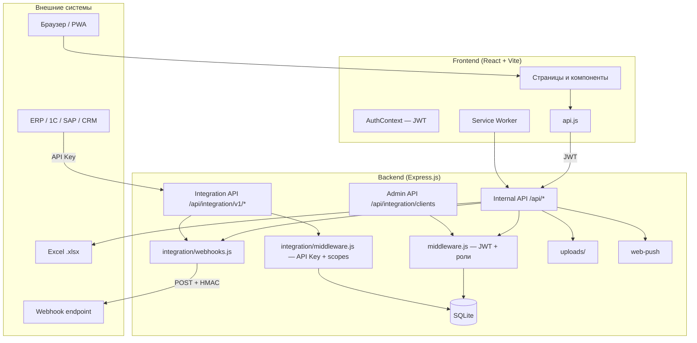

> Полный контракт Integration API: **[INTEGRATION_API.md](./INTEGRATION_API.md)**

---

## 2. Структура репозитория

```
atm-cleaning-control/
├── client/                     # Frontend
│   ├── public/
│   │   ├── manifest.json       # PWA-манифест
│   │   ├── sw.js               # Service Worker (push)
│   │   └── icon.svg
│   └── src/
│       ├── api.js              # Единая точка всех HTTP-запросов
│       ├── context/
│       │   └── AuthContext.jsx # Глобальное состояние авторизации
│       ├── components/         # Переиспользуемые UI-блоки
│       ├── pages/              # Экраны (маршруты)
│       │   ├── Settings.jsx    # Настройки CV (только bizadmin)
│       ├── offline/
│       │   ├── store.js            # IndexedDB: кэш заявок/фото, очередь
│       │   ├── sync.js             # Синхронизация очереди при online
│       │   └── registerSw.js       # Регистрация Service Worker
│       ├── hooks/
│       │   ├── useCvStatus.js      # Статус CV (enabled) для UI
│       │   ├── useOffline.js       # Статус сети и очереди
│       │   └── useNotifications.js
│       ├── utils/
│       │   ├── compressImage.js    # Сжатие фото в браузере
│       │   └── geolocation.js      # Запрос гео при входе, кэш координат (v2.1.0)
│       └── utils.js                # Константы, роли, проверка фото, getCloseMetadata
│
├── deploy/
│   ├── setup-server.sh
│   ├── build-client.sh         # Сборка фронта (мало-RAM VPS)
│   ├── ensure-swap.sh          # Swap перед vite build
│   ├── ecosystem.config.cjs
│   └── nginx-control-app.conf
│
├── server/                     # Backend
│   ├── db.js                   # Схема БД, сиды, миграции
│   ├── roles.js                # Роли: bizadmin, isManager, hasRoleAccess
│   ├── middleware.js           # JWT, проверка ролей
│   ├── push.js                 # Push-уведомления (web-push)
│   ├── index.js                # Точка входа Express
│   ├── integration/            # Слой интеграции с внешними АС
│   │   ├── middleware.js       # API Key, scopes, логирование
│   │   ├── schemas.js          # Форматы ответов для v1 API
│   │   └── webhooks.js         # Исходящие webhook-события
│   ├── cv/                     # CV-проверка фотоотчётов
│   │   ├── atmDetector.js      # CLIP zero-shot: банкомат Сбербанка на фото
│   │   ├── settings.js         # Настройки CV (cv_settings в БД)
│   │   └── validatePhotos.js   # Проверка ракурсов и сохранение результата
│   ├── utils/
│   │   └── optimizePhoto.js    # Сжатие на сервере (sharp) или passthrough
│   ├── middleware/
│   │   └── errorHandler.js     # Обработка ошибок API
│   ├── routes/
│   │   ├── auth.js
│   │   ├── users.js
│   │   ├── atms.js
│   │   ├── tasks.js
│   │   ├── photos.js
│   │   ├── settings.js         # GET/PATCH /api/settings/cv (bizadmin)
│   │   ├── notifications.js
│   │   └── integration.js      # v1 API + admin endpoints
│   └── uploads/                # Фотоотчёты (файловое хранилище)
│
├── package.json
├── CHANGELOG.md                # История версий (детали релизов)
├── ARCHITECTURE.md             # Этот документ
└── INTEGRATION_API.md          # Контракт для внешних систем
```

### Стек технологий

| Слой | Технология | Назначение |
|------|------------|------------|
| UI | React 19 + Vite | Интерфейс, быстрая разработка |
| Маршрутизация | React Router 7 | Экраны и защита по ролям |
| API | Express 4 | REST без лишней сложности |
| БД | SQLite (`node:sqlite`) | Файл `atm-cleaning.db`, без отдельного сервера СУБД |
| Авторизация | JWT + bcryptjs | Stateless-сессии |
| Файлы | Multer + **sharp** | Загрузка, сжатие и ресайз фото на диск |
| Отчёты | SheetJS (`xlsx`) | Импорт и экспорт Excel |
| Push | web-push + Service Worker | Фоновые уведомления |
| PWA | manifest.json + sw.js | Установка на мобильный экран |
| CV | CLIP (`@xenova/transformers`) | Банкомат Сбербанка (зелёный/серый) на фото |
| Интеграция | API Key + Webhooks | Обмен данными с ERP/CRM/1С |

---

## 3. Модель данных

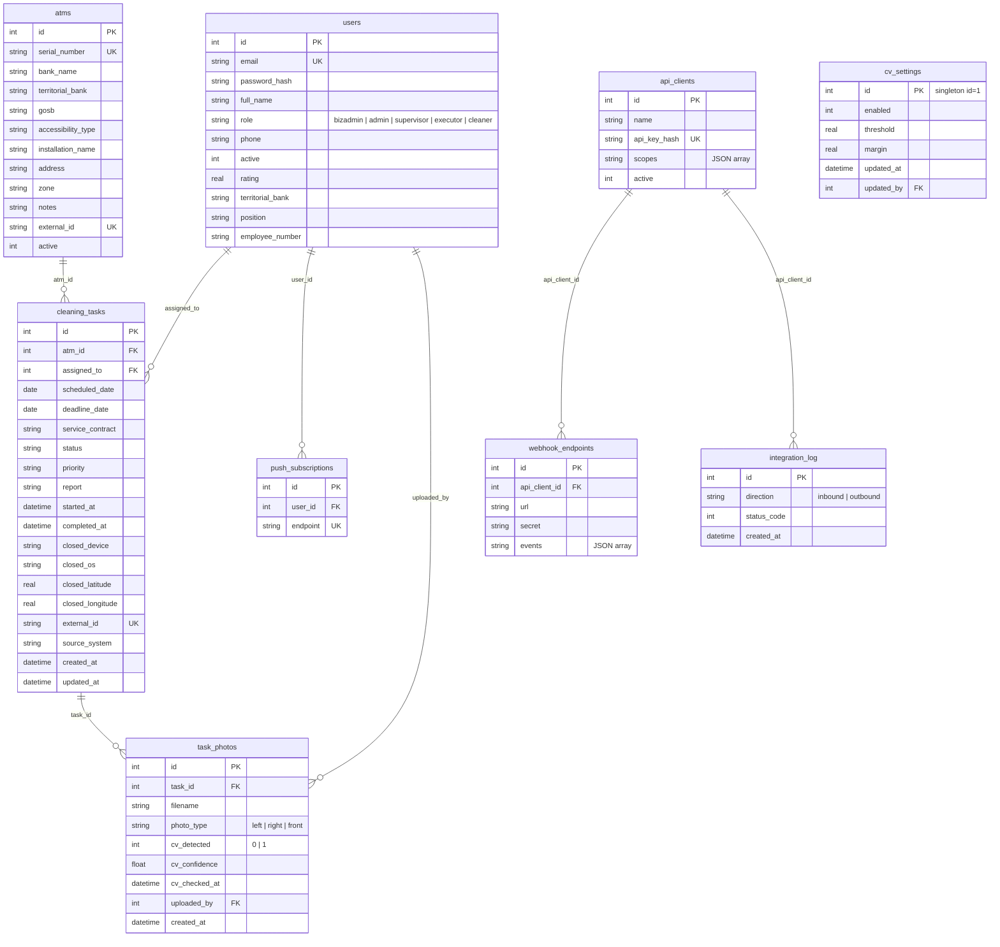

### Универсальные аналоги для других проектов

| Сущность сейчас | Универсальный аналог |
|-----------------|----------------------|
| `atms` | Объекты: офисы, магазины, оборудование |
| `cleaning_tasks` | Заявки, наряды, тикеты |
| `users` (executor / cleaner) | Исполнители, техники, курьеры |
| `task_photos` | Доказательства выполнения |
| `push_subscriptions` | Подписки на события |
| `api_clients` | Внешние системы с API-ключами |
| `cv_settings` | Параметры CV (вкл/выкл, порог, запас) — управление через bizadmin |
| `external_id` | Связь записей между АС |

---

## 4. Слой интеграции (Integration Layer)

### 4.1 Два направления обмена

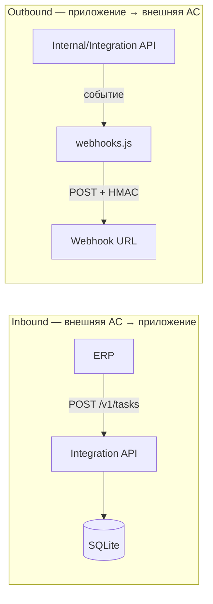

### 4.2 Integration API v1 (входящий)

| Endpoint | Scope | Описание |
|----------|-------|----------|
| `GET /v1/health` | любой ключ | Проверка доступности |
| `GET /v1/tasks` | `tasks:read` | Список заявок |
| `POST /v1/tasks` | `tasks:write` | Создание заявки |
| `POST /v1/tasks/batch` | `tasks:write` | Массовое создание |
| `PATCH /v1/tasks/:id` | `tasks:write` | Обновление статуса |
| `GET /v1/atms` | `atms:read` | Список банкоматов |
| `POST /v1/atms` | `atms:write` | Upsert банкомата |
| `GET /v1/stats` | `tasks:read` | Агрегированная статистика |

### 4.3 Webhooks (исходящий)

При любом изменении заявки (UI, Excel, Integration API) вызывается `dispatchWebhooks()`:

| Событие | Триггер |
|---------|---------|
| `task.created` | Создание заявки |
| `task.updated` | Изменение полей |
| `task.completed` | status → completed |
| `task.cancelled` | Отмена |
| `task.deleted` | Безвозвратное удаление (bizadmin) |
| `atm.created` / `atm.updated` | Синхронизация объектов |

### 4.4 Admin API (управление интеграцией)

Только для роли `admin` (JWT):

| Endpoint | Описание |
|----------|----------|
| `POST /api/integration/clients` | Создать API-ключ |
| `GET /api/integration/clients` | Список подключённых систем |
| `POST /api/integration/webhooks` | Зарегистрировать webhook URL |
| `GET /api/integration/logs` | Журнал запросов |

### 4.5 Демо-ключ для разработки

```
X-API-Key: atk_dev_integration_key_2026
```

---

## 5. Роли и доступ к Internal API

Роли определены в `server/roles.js`. Роль **`bizadmin`** (бизнес-администратор) автоматически проходит любую проверку `requireRole(...)` и объединяет права **admin** и **supervisor**. Дополнительно доступны только ей:

- UI: `/settings` — включение CV, порог (`threshold`) и запас (`margin`)
- API: `GET/PATCH /api/settings/cv`

Администратор (`admin`) не может создавать, редактировать или удалять учётные записи `bizadmin`.

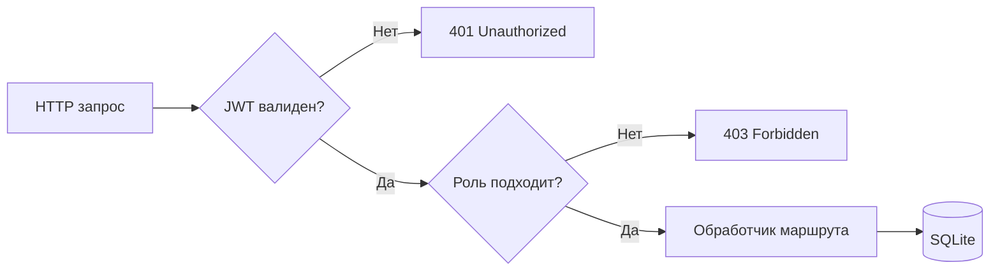

| Маршрут | bizadmin | admin | supervisor | executor | Описание |
|---------|:--------:|:-----:|:----------:|:--------:|----------|
| `POST /api/auth/login` | ✓ | ✓ | ✓ | ✓ | Вход |
| `GET /api/auth/me` | ✓ | ✓ | ✓ | ✓ | Текущий пользователь |
| `GET /api/tasks` | все | все | все | только свои | Список заявок |
| `POST /api/tasks` | ✓ | ✓ | ✓ | — | Создание заявки |
| `POST /api/tasks/import` | ✓ | ✓ | ✓ | — | Импорт из Excel |
| `GET /api/tasks/export` | ✓ | ✓ | ✓ | — | Экспорт в Excel |
| `PATCH /api/tasks/:id` | ✓ | ✓ | ✓ | свои | Изменение / завершение |
| `DELETE /api/tasks/:id` | ✓ | ✓ | ✓ | — | Отмена заявки (статус `cancelled`) |
| `DELETE /api/tasks/:id/permanent` | ✓ | — | — | — | Безвозвратное удаление заявки, фото и файлов |
| `GET /api/atms` | ✓ | ✓ | ✓ | ✓ | Список банкоматов |
| `POST /api/atms` | ✓ | ✓ | ✓ | — | Добавление банкомата |
| `GET /api/users` | все | все | только cleaner | — | Список пользователей |
| `POST /api/users` | все роли | admin/supervisor/cleaner | только cleaner | — | Создание учётной записи |
| `DELETE /api/users/:id` | ✓ | ✓* | cleaner | — | Удаление / деактивация |
| `POST /api/photos/:taskId` | ✓ | ✓ | ✓ | свои | Загрузка → сжатие → CV в фоне |
| `GET /api/photos/:taskId` | ✓ | ✓ | ✓ | свои* | Список фото (`cv_detected`, `cv_confidence`) |
| `GET/PATCH /api/settings/cv` | ✓ | — | — | — | Полные настройки CV (bizadmin) |
| `GET /api/settings/cv/status` | ✓ | ✓ | ✓ | ✓ | Статус CV вкл/выкл (для UI) |
| `POST /api/notifications/subscribe` | ✓ | ✓ | ✓ | ✓ | Подписка на push |

\* admin не управляет учётными записями `bizadmin`

Проверка ролей: `server/middleware.js` (`requireRole`, `requireBizAdmin`).

---

## 6. Бизнес-процессы

### 6.1 Жизненный цикл заявки

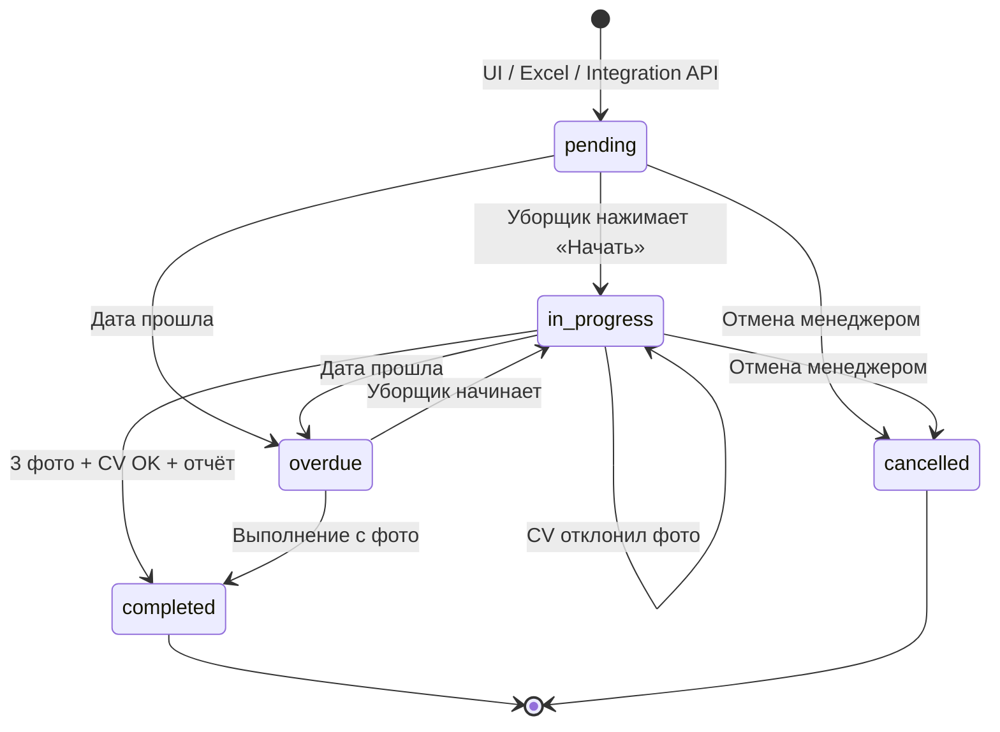

### 6.2 Фотоотчёт (обязательные ракурсы)

Перед завершением заявки уборщик обязан загрузить три фото:

| `photo_type` | Подпись в UI |
|--------------|--------------|
| `left` | Слева |
| `right` | Справа |
| `front` | Спереди |

### 6.2.1 Сжатие и оптимизация разрешения

Двухэтапный пайплайн (v1.2.0):

| Этап | Где | Описание |
|------|-----|----------|
| 1. Браузер | `client/src/utils/compressImage.js` | Ресайз до `PHOTO_MAX_EDGE` (1280px), JPEG ~82% **до** отправки на сервер |
| 2. Сервер | `server/utils/optimizePhoto.js` | sharp — только если файл > `PHOTO_PASSTHROUGH_MAX_BYTES`; иначе **passthrough** (сохранение как есть) |

| Параметр | По умолчанию | Описание |
|----------|--------------|----------|
| `PHOTO_MAX_EDGE` | `1280` | Макс. длинная сторона (браузер и sharp) |
| `PHOTO_JPEG_QUALITY` | `82` | Качество JPEG |
| `PHOTO_UPLOAD_MAX_MB` | `12` | Лимит multer до сжатия |
| `PHOTO_PASSTHROUGH_MAX_BYTES` | `1800000` | Файлы меньше этого на сервере не обрабатываются sharp |
| `PHOTO_SKIP_SHARP` | `false` | `true` — всегда passthrough (рекомендуется на VPS < 1 GB RAM) |

Типичный размер после сжатия в браузере: **150–500 КБ** вместо 3–8 МБ с камеры.

### 6.2.2 CV-проверка банкомата на фото

Модуль `server/cv/` использует **CLIP zero-shot** (`Xenova/clip-vit-base-patch32`).

| Этап | Действие |
|------|----------|
| Старт сервера | `warmupCvModel()` — предзагрузка модели (v2.1.0) |
| Настройки | `cv_settings` в БД; UI bizadmin — `/settings`; статус — `GET /api/settings/cv/status` |
| CV выключена | UI без текстов про CV; завершение — только 3 фото; сервер не запускает CLIP |
| CV включена | Загрузка фото → CV **синхронно в очереди** `runInCvQueue` → ответ с `cv_detected` |
| Завершение (executor) | Повторная проверка всех ракурсов; при отказе — `in_progress`, код `cv_rejected` |

Проверка **обязательна для роли `executor`/`cleaner`** и **только если CV включена**.

**Таймауты клиента (v2.1.0):** `uploadPhoto` и `PATCH` с `status=completed` — **120 с** (`REQUEST_TIMEOUT_MS` = 20 с для остальных запросов).

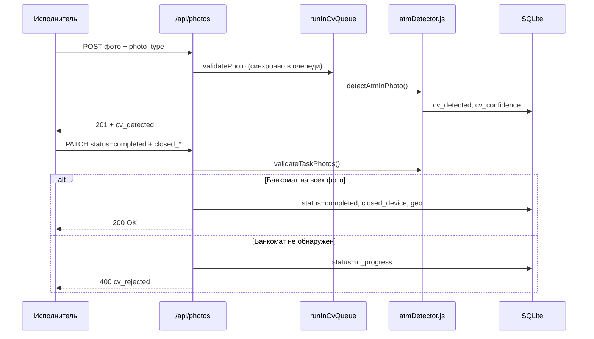

### 6.2.3 Данные при закрытии заявки (v2.0.0+)

При `PATCH /api/tasks/:id` с `status=completed` в БД сохраняются:

| Поле | Источник | Описание |
|------|----------|----------|
| `closed_device` | Клиент / User-Agent | Тип устройства и браузер |
| `closed_os` | Клиент | Платформа (Android, Windows, …) |
| `closed_latitude` | Геолокация | Широта |
| `closed_longitude` | Геолокация | Долгота |

Клиент: `getCloseMetadata()` в `utils.js` + кэш `utils/geolocation.js`.

**Геолокация (v2.1.0):**

1. При клике **«Войти»** — `requestGeolocationAccess()` (диалог браузера в цепочке user gesture).
2. Кэш в `localStorage` (`geo_position_cache`).
3. При завершении заявки — `refreshGeolocationIfGranted()` без повторного диалога.
4. Отображение в UI — блок **«Данные при закрытии»** в `TaskModal`.

> Требуется **HTTPS** (или localhost). На HTTP `navigator.geolocation` недоступен.

### 6.2.4 Завершение заявки в UI (v2.1.0)

| Точка входа | Компонент | Условие показа «Завершить» |
|-------------|-----------|------------------------------|
| Список (desktop) | `Tasks.jsx` таблица | `canExecutorCompleteTask(task, userId)` |
| Список (mobile) | `TaskCard.jsx` | то же |
| Модалка | `CompleteModal` | Исполнитель, назначенная заявка |
| Модалка «Открыть» | `TaskModal` | `canComplete` + фото и CV готовы |

Статусы, при которых исполнитель может завершить: `in_progress`, `overdue`, `returned`, `emergency` (`EXECUTOR_COMPLETABLE_STATUSES` в `utils.js`).

Просрочка: при загрузке списка `markOverdue()` переводит заявки с прошедшим контрольным сроком в `overdue` — кнопка «Завершить» остаётся доступной (v2.1.0).

### 6.3 Импорт заявок из Excel

**Шаблон** (`GET /api/tasks/import-template`) содержит столбцы:

| Столбец | Обязательный | Формат |
|---------|:------------:|--------|
| Банкомат | да | `ATM-001` (serial_number) |
| Дата | да | `ГГГГ-ММ-ДД` или `ДД.ММ.ГГГГ` |
| Email уборщика | нет | email или ФИО |
| Приоритет | нет | низкий / обычный / высокий |
| Примечание | нет | текст |

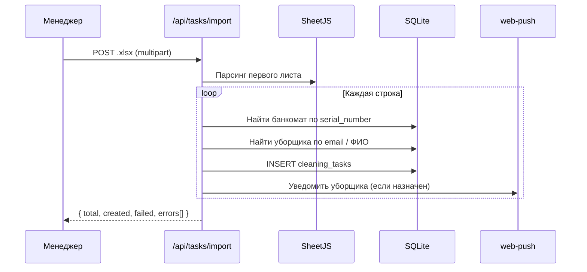

### 6.4 Push-уведомления

| Событие | Кому | Триггер |
|---------|------|---------|
| Новая заявка | Уборщик | Создание / назначение |
| CV отклонил фото | Уборщик | Банкомат не обнаружен при завершении |
| Просрочка | admin, supervisor | Автоматически при запросе stats/tasks |
| Уборка выполнена | admin, supervisor | status → completed |

---

## 7. Frontend

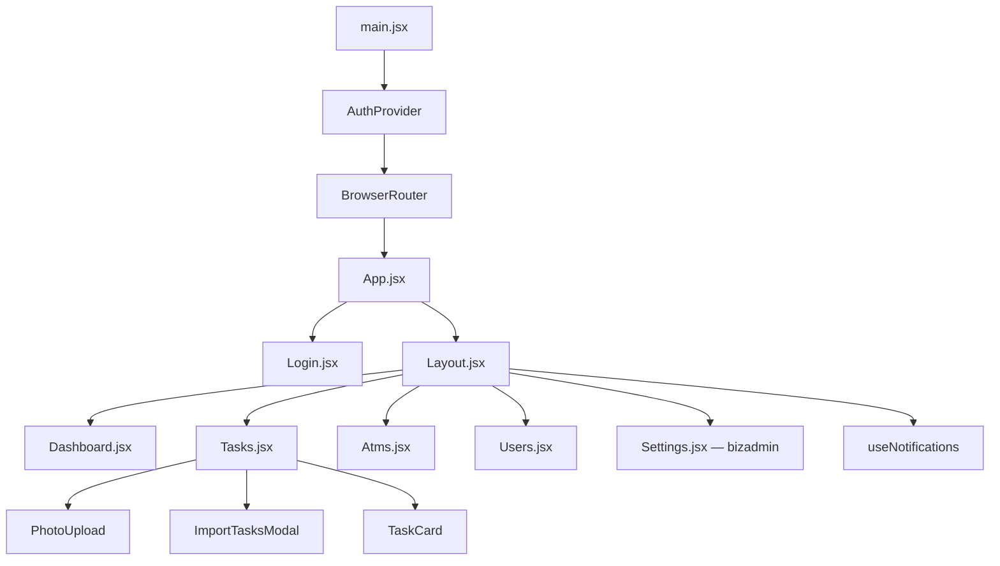

### 7.1 Структура `client/src` и импорты

Важно не путать **корневой** `utils.js` и **папку** `utils/`:

```
client/src/
├── utils.js              # Константы, роли, getCloseMetadata, canExecutorCompleteTask
├── utils/
│   ├── geolocation.js    # Геолокация: запрос при входе, кэш координат
│   └── compressImage.js  # Сжатие JPEG перед upload
├── pages/
├── components/
└── context/
```

| Модуль | Кто импортирует | Корректный путь |
|--------|-----------------|-----------------|
| `geolocation.js` | `utils.js` | `./utils/geolocation.js` |
| `geolocation.js` | `Login.jsx`, `AuthContext.jsx` | `../utils/geolocation` |
| `utils.js` (константы) | страницы, компоненты | `../utils` |

Ошибка `./geolocation.js` из `src/utils.js` **ломает production-сборку** (`vite build`).

### 7.2 Модуль геолокации (`utils/geolocation.js`)

| Функция | Когда вызывается | Поведение |
|---------|------------------|-----------|
| `requestGeolocationAccess()` | Клик «Войти» в `Login.jsx` | Показывает диалог браузера (user gesture); сохраняет координаты |
| `refreshGeolocationIfGranted()` | `api.me()` после автологина; `getCloseMetadata()` | Без диалога, если разрешение уже `granted` |
| `getCachedGeolocation()` | Чтение кэша | `{ latitude, longitude, at }` или `null` |
| `getGeolocationPermissionState()` | Внутренне | `granted` / `denied` / `prompt` |

**localStorage:**

- `geo_position_cache` — последние координаты.
- `geo_permission_state` — fallback при отсутствии Permissions API.

**Ограничения браузера:** геолокация только в secure context (HTTPS / localhost). Первый запрос разрешения — только из обработчика действия пользователя.

### 7.3 Завершение заявки (исполнитель)

Хелпер `canExecutorCompleteTask(task, userId)` в `utils.js`:

- Назначение: `Number(task.assigned_to) === Number(userId)`.
- Статусы: `in_progress`, `overdue`, `returned`, `emergency`.

Точки UI: таблица/карточка (`Tasks.jsx`, `TaskCard.jsx`), `CompleteModal`, `TaskModal` (кнопка «Завершить» + поле «Отчёт»).

При `overdue` кнопка не скрывается — заявка могла перейти в просрочку автоматически (`markOverdue()` на сервере при `GET /api/tasks`).

### 7.4 Мобильные вкладки исполнителя (v2.2.0 — v2.2.3)

На экранах **&lt; 768px** для роли **исполнитель** на странице `/tasks` список заявок разбит на вкладки в **нижней навигации** (`mobile-nav`). **v2.2.3:** по одной вкладке на каждый статус из фильтра (8 шт., сетка **4×2**):

| Вкладка (`STATUS_LABELS`) | Статус в БД |
|---------------------------|-------------|
| Новая | `new` |
| В работе | `in_progress` |
| Выполнено | `completed` |
| Просрочено | `overdue` |
| Возврат | `returned` |
| Отменено | `cancelled` |
| Нет доступа | `no_access` |
| Экстренная заявка | `emergency` |

- Каждая вкладка показывает **счётчик** заявок (бейдж).
- **v2.2.2:** вкладки встроены в `mobile-nav` (класс `.executor-status-nav`); состояние через `ExecutorTasksNavContext`.
- Блок «Фильтры» для исполнителя **доступен**; выпадающий «Статус» скрыт при мобильных вкладках.
- Загрузка с API **без** фильтра `status`, фильтрация на клиенте по `filterTasksByExecutorTab`.
- `?status=...` в URL открывает соответствующую вкладку.

Константы `TASK_FILTER_STATUSES`, `EXECUTOR_MOBILE_TABS` — `client/src/utils.js`; UI — `ExecutorStatusNav.jsx`.

### 7.5 Массовое назначение заявок (v2.2.3)

Для **менеджеров** (admin, supervisor, bizadmin) при **активных фильтрах** (`activeFilterCount > 0`):

1. Панель `.bulk-assign-bar`: выбор исполнителя, «Выбрать все», «Сбросить», «Назначить (N)».
2. Чекбоксы в `TaskCard` (мобильные) и в таблице (десктоп).
3. Назначаются только заявки, проходящие `canBulkAssignTask` (не `completed` / `cancelled`).
4. Назначение — параллельные `PATCH /api/tasks/:id` с `{ assigned_to }`.

### 7.6 Фильтры заявок (десктоп, v2.2.2)

Блок `.filters.filters-extended` использует `flex` + сетку `.filters-body` (`auto-fill`, minmax 180px) на **полную ширину** карточки. Ранее наследование трёхколоночной сетки `.filters` обрезало поля примерно наполовину экрана.

### Ключевые файлы

| Файл | Назначение | При адаптации |
|------|------------|---------------|
| `src/api.js` | Все HTTP-запросы | Добавить/изменить endpoints |
| `src/utils.js` | Статусы, роли, типы фото, `canExecutorCompleteTask`, `getCloseMetadata` | Вынести в `domain.config.js` |
| `src/utils/geolocation.js` | Запрос гео при входе, кэш, обновление при закрытии | v2.1.0 |
| `src/context/AuthContext.jsx` | JWT, текущий пользователь, refresh geo при `api.me()` | Обычно не меняется |
| `src/App.jsx` | Маршруты + `PrivateRoute` | Добавить страницы, роли |
| `src/pages/Settings.jsx` | Вкл/выкл CV, порог и запас | Только роль `bizadmin` |
| `src/hooks/useCvStatus.js` | Статус CV для PhotoUpload и завершения заявки | — |
| `src/utils/compressImage.js` | Сжатие JPEG в браузере перед upload | `PHOTO_MAX_EDGE` |
| `PhotoUpload.jsx` | Слоты фото, бейджи CV (если включена) | Не блокирует UI при загрузке CV/фото (v1.3.2) |
| `src/components/ImportTasksModal.jsx` | UI импорта Excel | Обновить описание столбцов |
| `src/index.css` | Глобальная тема, layout, карточки, таблицы, login | Брендинг через CSS-переменные |

### Мобильная версия и PWA

- Пункт «Заявки» в нижней навигации на экранах < 768px (`Layout.jsx`)
- Карточки заявок вместо таблицы (`TaskCard.jsx`)
- **Сворачиваемые фильтры** (v2.1.0): на экранах &lt; 768px блок фильтров в `Tasks.jsx` по умолчанию скрыт; кнопка «Фильтры» с бейджем активных фильтров (для менеджеров и десктопа)
- **Вкладки исполнителя** (v2.2.0+): на мобильных у исполнителя на странице заявок — вкладки по статусам со счётчиками в `mobile-nav` (сетка 3×2); фильтры остаются доступными
- `manifest.json` — установка на домашний экран (`display: standalone`)
- `public/sw.js` — кэш app shell и статики, push-события
- **iOS safe area** (v1.3.3): `viewport-fit=cover` + `env(safe-area-inset-*)` в `index.css` и нижней навигации — контент не перекрывает статус-бар
- **Поля даты** (v1.3.4+): `DateInput` — равная ширина с «Статусом» в фильтрах, `showPicker()` и иконка календаря в десктопном браузере

### Офлайн-режим и устойчивая загрузка (v1.3.0+)

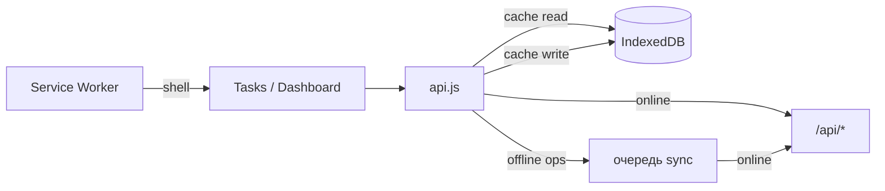

| Компонент | Назначение |
|-----------|------------|
| `offline/store.js` | Кэш заявок и фото, очередь PATCH/upload |
| `offline/sync.js` | Сброс очереди при `online`, событие `offline-synced` |
| `api.js` | Офлайн-fallback: при ошибке сети — данные из IndexedDB; фото в очереди хранятся как `blobData` |
| `AuthContext.jsx` | Кэш `offline_user` в localStorage при сетевых сбоях |

**v1.3.1 — защита от зависания UI:**

| Механизм | Значение | Эффект |
|----------|----------|--------|
| Таймаут HTTP | 20 с (`REQUEST_TIMEOUT_MS`) | Зависший сервер не блокирует экран навсегда |
| Запись в IndexedDB | в фоне (`void cacheTasks(...)`) | Успешный ответ API сразу отображается в UI |
| Таймаут IndexedDB | 5 с | Повреждённая БД не подвешивает загрузку |
| `Tasks.jsx` | заявки отдельно от `getAtms`/`getUsers` | Список заявок виден даже при сбое справочников |
| Ошибки загрузки | `loadError` в UI | Вместо пустого списка и «Загрузка...» — текст ошибки |

**v1.3.2 — фотоотчёт в модале заявки:**

| Механизм | Эффект |
|----------|--------|
| `useCvStatus` без блокирующего `loading` | Статус CV подгружается в фоне |
| `getCvStatus` / `getPhotos` | `setMeta` и кэш фото — в фоне; при сетевой ошибке — пустой список, можно загрузить фото |
| `PhotoUpload.jsx` | Слоты 📷 видны сразу; полная блокировка только в режиме просмотра (`readOnly`) |

---

## 8. Запуск и деплой

### Разработка

```bash
# Установка
npm install --prefix server
npm install --prefix client

# Запуск (два процесса)
# Терминал 1
cd server && npm run dev    # http://localhost:3001

# Терминал 2
cd client && npm run dev    # http://localhost:5173 (proxy /api → 3001)
```

### Production (локально)

```bash
npm run build --prefix client   # → client/dist/
npm run start --prefix server   # Express отдаёт API + статику с :3001
```

### Production (VPS / Reg.ru)

В репозитории есть готовые конфиги в `deploy/`:

| Файл | Назначение |
|------|------------|
| `deploy/setup-server.sh` | Автонастройка: сборка, pm2, nginx |
| `deploy/build-client.sh` | Сборка фронта с подсказками по swap |
| `deploy/ensure-swap.sh` | Создание swap на мало-RAM VPS |
| `deploy/ecosystem.config.cjs` | Конфиг pm2 для `control-app` |
| `deploy/nginx-control-app.conf` | Nginx reverse proxy, таймауты загрузки фото |
| `server/.env.example` | Шаблон переменных (`PHOTO_SKIP_SHARP` и др.) |

```bash
sudo bash deploy/setup-server.sh
```

Схема на сервере:

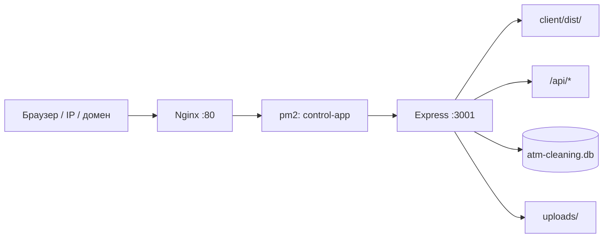

Управление процессом:

```bash
pm2 status
pm2 restart control-app
pm2 logs control-app
```

> Не запускайте второй экземпляр через `npm start`, если pm2 уже держит порт 3001 (`EADDRINUSE`).

При включённой CV-проверке (`CV_ENABLED=true`) модель CLIP **предзагружается** при старте (`warmupCvModel` в `server/index.js`, ~150 MB в `.cache/transformers`). Рекомендуется **≥1 GB RAM** или swap + `PHOTO_SKIP_SHARP=true`.

### Типичные ошибки деплоя

| Симптом | Причина | Решение |
|---------|---------|---------|
| **502** в браузере | Node.js не запустился | `pm2 logs control-app`; синтаксис в `server/routes/tasks.js`; `pm2 restart` |
| **`vite build` Killed** | OOM на VPS | `sudo bash deploy/ensure-swap.sh`; или сборка на ПК + `scp client/dist` |
| **`Could not resolve "./geolocation.js"`** | Неверный импорт в `src/utils.js` | `./utils/geolocation.js` (v2.1.1+) |
| Старый UI после `git pull` | Не пересобран `client/dist` | `bash deploy/build-client.sh` |
| Геолокация не запрашивается | HTTP вместо HTTPS | Только HTTPS или localhost |
| `EADDRINUSE :3001` | Два процесса на порту | `pm2 delete control-app` → `pm2 start deploy/ecosystem.config.cjs` |

**Проверка сборки локально:**

```bash
npm run build --prefix client
# ожидается: ✓ built in ... dist/index.html
```

**Полный цикл обновления:**

```bash
cd ~/control-app
git pull
npm install --prefix server    # если менялся server/package-lock.json
bash deploy/build-client.sh
pm2 restart control-app
pm2 logs control-app --lines 20
```

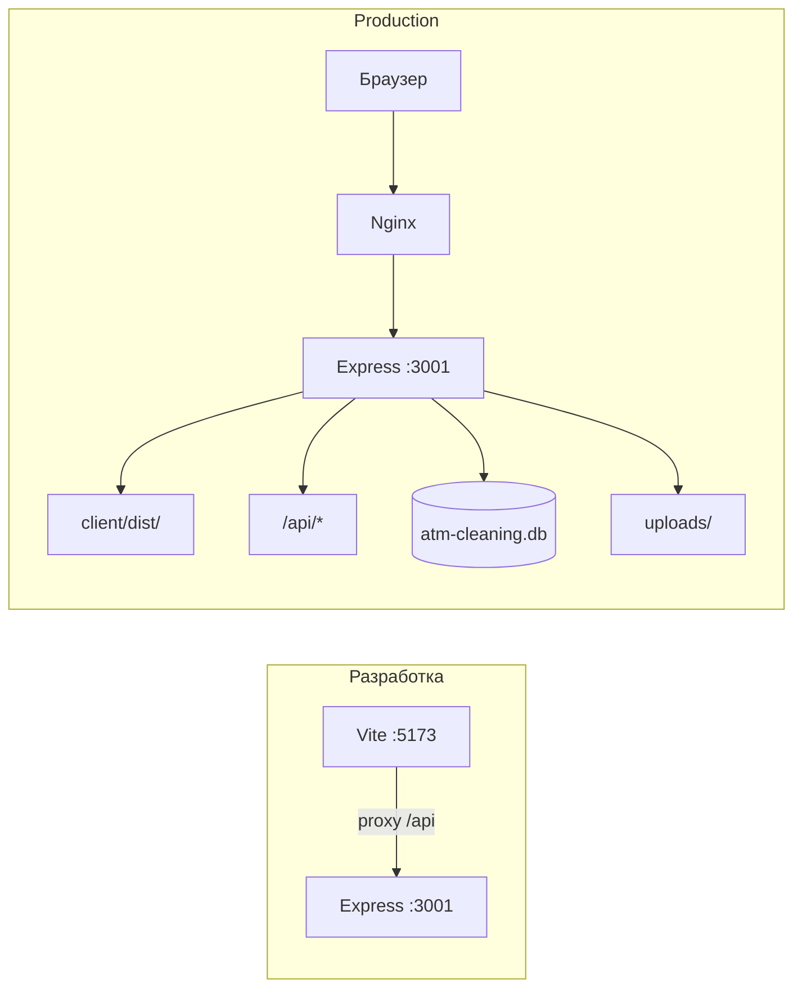

### Демо-аккаунты

| Email | Роль | Пароль |
|-------|------|--------|
| bizadmin@bank.ru | Бизнес-администратор | admin123 |
| admin@bank.ru | Администратор | admin123 |
| supervisor@bank.ru | Супервайзер | admin123 |
| cleaner1@bank.ru | Уборщик | admin123 |

---

## 9. Адаптация под другой проект

### Минимальный чеклист

| # | Что менять | Где |
|---|------------|-----|
| 1 | Название сущности «объект» | `atms` → `locations`, `server/routes/atms.js`, `pages/Atms.jsx` |
| 2 | Роли пользователей | `db.js` CHECK, `middleware.js`, `utils.js` |
| 3 | Статусы заявок | `db.js`, `utils.js`, `routes/tasks.js` |
| 4 | Обязательные фото | `REQUIRED_PHOTO_TYPES` в `db.js`, `PHOTO_TYPES` в `utils.js` |
| 4a | Сжатие фото | `server/utils/optimizePhoto.js`, `PHOTO_MAX_EDGE`, `PHOTO_JPEG_QUALITY` |
| 4b | CV-модель, порог и margin | `server/cv/atmDetector.js`, `CV_ATM_THRESHOLD`, `CV_ATM_MARGIN` |
| 5 | Excel-шаблон | `routes/tasks.js` → `/import-template` и `/import` |
| 6 | Тексты push | `server/push.js` |
| 7 | Брендинг | `manifest.json`, `index.html`, CSS-переменные в `index.css` |
| 8 | Integration API | `routes/integration.js`, `INTEGRATION_API.md` |
| 9 | Webhook-события | `integration/webhooks.js`, `WEBHOOK_EVENTS` |
| 10 | Scopes | `api_clients.scopes` при создании ключей |

### Что можно не менять

- JWT-авторизация (`middleware.js`, `AuthContext.jsx`)
- Integration Layer (`integration/*`) — меняются только scopes и события
- Структура `api.js`
- PWA (manifest + service worker)
- Паттерн импорта/экспорта Excel
- Мобильная навигация и анимации
- Разграничение доступа через `PrivateRoute` и `requireRole`
- Паттерн `external_id` для синхронизации с внешними АС

### Масштабирование

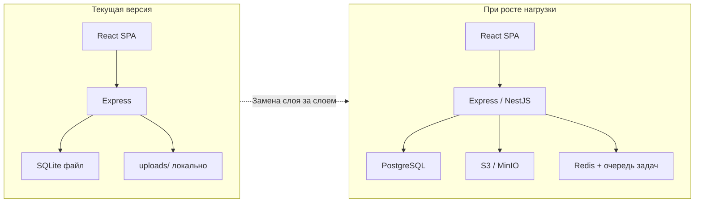

| Компонент | Сейчас | Возможная замена |
|-----------|--------|------------------|
| БД | SQLite (`node:sqlite`) | PostgreSQL — тот же SQL, другой драйвер |
| Файлы | `server/uploads/` | S3 / MinIO — меняется `routes/photos.js` и `cv/` |
| CV | CLIP on-node | Отдельный GPU-сервис / облачный Vision API |
| Push | web-push (VAPID) | FCM, OneSignal — меняется `push.js` |
| Auth | JWT в localStorage | OAuth2, Keycloak — меняется `middleware.js` |
| Очереди | Синхронно в HTTP | BullMQ / Redis для импорта и уведомлений |

---

## 10. Переменные окружения

| Переменная | По умолчанию | Описание |
|------------|--------------|----------|
| `PORT` | `3001` | Порт сервера (pm2 / `server/.env`) |
| `JWT_SECRET` | dev-секрет | Ключ подписи JWT |
| `VAPID_PUBLIC` | встроенный | Публичный ключ web-push |
| `VAPID_PRIVATE` | встроенный | Приватный ключ web-push |
| `CV_ENABLED` | `true` | Начальное значение «CV включена» (далее — `cv_settings`) |
| `CV_ATM_THRESHOLD` | `0.30` | Начальный порог уверенности «банкомат Сбербанк» (0–1) |
| `CV_ATM_MARGIN` | `0.12` | Начальный запас над метками «пол/стена» |
| `CV_TIMEOUT_MS` | `45000` | Таймаут одной CV-проверки (мс) |
| `PHOTO_MAX_EDGE` | `1280` | Макс. длинная сторона фото после сжатия (px) |
| `PHOTO_JPEG_QUALITY` | `82` | Качество JPEG при сохранении |
| `PHOTO_UPLOAD_MAX_MB` | `12` | Лимит исходника до сжатия (МБ) |
| `PHOTO_PASSTHROUGH_MAX_BYTES` | `1800000` | Порог passthrough без sharp (~1.8 МБ) |
| `PHOTO_SKIP_SHARP` | `false` | `true` — не использовать sharp на сервере |

Шаблон для production: `server/.env.example` → скопировать в `server/.env`.

Для production задайте собственные `JWT_SECRET` и VAPID-ключи:

```bash
npx web-push generate-vapid-keys
```

---

## 11. Резюме

Приложение — **шаблон системы полевого контроля с Integration Layer**:

1. **Менеджер** планирует заявки (UI, Excel, внешние АС через API).
2. **Исполнитель** выполняет на объекте (статусы + сжатые фото + CV-подтверждение банкомата Сбербанка).
3. **Система** отслеживает просрочки, шлёт push и webhook-события.
4. **Внешние АС** (ERP, 1С, CRM) синхронизируют данные через Integration API v1.
5. **Бизнес-администратор** управляет параметрами CV без перезапуска сервера.

### Документация

| Файл | Содержание |
|------|------------|
| [CHANGELOG.md](./CHANGELOG.md) | История версий, коммиты, инструкции проверки после деплоя |
| [ARCHITECTURE.md](./ARCHITECTURE.md) | Архитектура, модель данных, процессы |
| [INTEGRATION_API.md](./INTEGRATION_API.md) | Контракт API, webhooks, примеры кода |

Архитектура модульная: доменная логика в `routes/`, интеграция изолирована в `integration/`, UI в `client/src/pages/`.

---

## 12. История версий

| Версия | Дата | Изменения |
|--------|------|-----------|
| v2.2.3 | 2026-06-13 | 8 статусов в mobile-nav, массовое назначение — см. [CHANGELOG.md](./CHANGELOG.md) |
| v2.2.2 | 2026-06-13 | Статусы в mobile-nav, фикс ширины фильтров (десктоп) — см. [CHANGELOG.md](./CHANGELOG.md) |
| v2.2.1 | 2026-06-13 | Вкладки исполнителя внизу (3×2), фильтры восстановлены — см. [CHANGELOG.md](./CHANGELOG.md) |
| v2.2.0 | 2026-06-13 | Вкладки заявок по статусам для исполнителя на мобильных — см. [CHANGELOG.md](./CHANGELOG.md) |
| v2.1.1 | 2026-06-13 | Импорт `./utils/geolocation.js`; таблицы деплоя и импортов в документации |
| v2.1.0 | 2026-06-13 | Геолокация при входе; сворачиваемые фильтры; завершение из TaskModal и для overdue; фиксы CV/502; блок «Данные при закрытии» — см. [CHANGELOG.md](./CHANGELOG.md) |
| v2.0.0 | 2026-06-06 | Устройства СО, сотрудники, статусы v2, исполнитель, рейтинг, watermark, геополя при закрытии |
| v1.4.0 | 2026-06-06 | Удаление заявок bizadmin: `DELETE /api/tasks/:id/permanent`, webhook `task.deleted` |
| v1.3.9 | 2026-06-06 | `photo_blobs` в IndexedDB, `getMergedPhotosForTask`, исправление гонки UI при очереди |
| v1.3.8 | 2026-06-06 | Визуальное обновление UI (v1.3.8): единая тема в `index.css`, mobile nav, карточки |
| v1.3.7 | 2026-06-06 | Предпросмотр офлайн-фото без перезахода; автосинхронизация очереди с retry |
| v1.3.6 | 2026-06-06 | Компонент `DateInput`, сетка фильтров, всплывающий календарь в веб-UI |
| v1.3.5 | 2026-06-06 | Синхронизация офлайн-очереди: `blobData` в IndexedDB, проверка `/auth/me`, UI-обратная связь |
| v1.3.4 | 2026-06-06 | Исправление переполнения поля «Дата» в фильтрах и формах |
| v1.3.3 | 2026-06-06 | Safe-area отступы для PWA на iPhone (статус-бар, нижняя панель) |
| v1.3.2 | 2026-06-06 | Исправление зависания загрузки фото в UI заявки |
| v1.3.1 | 2026-06-06 | Таймаут API 20 с, неблокирующий IndexedDB, раздельная загрузка заявок/справочников, fallback `offline_user` при сетевых ошибках |
| v1.3.0 | 2026-06-13 | Офлайн-режим: Service Worker, IndexedDB, очередь синхронизации, баннер сети |
| v1.2.0 | 2026-06-13 | Сжатие фото в браузере, `PHOTO_SKIP_SHARP`/passthrough, UI зависит от CV status, ленивая загрузка CLIP, `ensure-swap`/`build-client`, исправления 502 и модала заявок |
| v1.1.0 | 2026-06-12 | Роль `bizadmin`, настройки CV в UI (`/settings`, `cv_settings`), CLIP-проверка Сбербанка |
| v1.0.0 | 2026-06-10 | Первый релиз: заявки, банкоматы, Excel, push, Integration API v1 |
