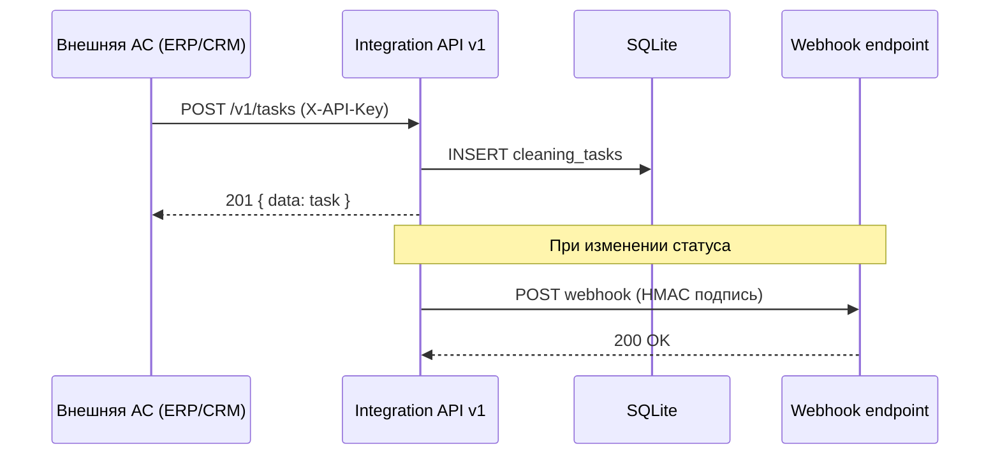

# Integration API — контракт для внешних систем

Версия: **v1**  
Базовый URL (dev): `http://localhost:3001/api/integration/v1`  
Базовый URL (production): `https://<ваш-домен>/api/integration/v1`

> В UI сущность называется **«Заявки»**; в API и коде по-прежнему используются пути `/tasks` и таблица `cleaning_tasks`.

Документ описывает REST API для интеграции с ERP, CRM, Service Desk, системами планирования и другими АСУ.

---

## 1. Обзор

| Направление | Механизм | Назначение |
|-------------|----------|------------|
| **Inbound** (входящие) | REST + API Key | Внешняя система читает/создаёт данные |
| **Outbound** (исходящие) | Webhooks + HMAC | Приложение уведомляет внешнюю систему о событиях |
| **Управление** | REST + JWT (admin) | Создание API-ключей и webhook-эндпоинтов |



---

## 2. Аутентификация

### 2.1 API Key (для `/v1/*`)

Передайте ключ в заголовке:

```http
X-API-Key: atk_your_secret_key_here
```

Альтернативный формат:

```http
Authorization: ApiKey atk_your_secret_key_here
```

| Код | Описание |
|-----|----------|
| `401` | Ключ отсутствует или недействителен |
| `403` | Ключ валиден, но нет нужного scope |

### 2.2 Scopes (области доступа)

| Scope | Доступ |
|-------|--------|
| `tasks:read` | Чтение заявок и статистики |
| `tasks:write` | Создание и изменение заявок |
| `atms:read` | Чтение банкоматов |
| `atms:write` | Создание / обновление банкоматов |
| `*` | Полный доступ |

### 2.3 Демо-ключ (только dev)

```
atk_dev_integration_key_2026
```

> В production создайте собственные ключи через Admin API (раздел 8).

---

## 3. Формат ответов

### Успех

```json
{
  "data": { ... },
  "meta": { "count": 1 }
}
```

### Ошибка

```json
{
  "error": "validation_error",
  "message": "scheduled_date обязателен"
}
```

| `error` | HTTP | Описание |
|---------|------|----------|
| `unauthorized` | 401 | Проблема с API-ключом |
| `forbidden` | 403 | Недостаточно scope |
| `not_found` | 404 | Ресурс не найден |
| `validation_error` | 400 | Невалидные данные |
| `conflict` | 409 | Дубликат (external_id, serial_number) |

---

## 4. Endpoints

### 4.1 Health Check

```http
GET /v1/health
```

**Ответ `200`:**

```json
{
  "status": "ok",
  "service": "atm-cleaning-control",
  "version": "1.0.0",
  "timestamp": "2026-06-10T12:00:00.000Z"
}
```

---

### 4.2 Заявки (`/v1/tasks`)

#### Список заявок

```http
GET /v1/tasks?status=pending&date=2026-06-10&external_id=ERP-1001
```

| Параметр | Тип | Описание |
|----------|-----|----------|
| `status` | string | `pending`, `in_progress`, `completed`, `overdue`, `cancelled` |
| `date` | string | Дата планирования `ГГГГ-ММ-ДД` |
| `external_id` | string | Внешний ID заявки |
| `updated_since` | string | ISO datetime, заявки созданные после |

**Scope:** `tasks:read`

**Ответ `200`:**

```json
{
  "data": [
    {
      "id": 1,
      "external_id": "ERP-1001",
      "atm": {
        "id": 1,
        "serial_number": "ATM-001",
        "bank_name": "Сбербанк",
        "address": "ул. Ленина, 15",
        "zone": "Центр",
        "external_id": "LOC-001"
      },
      "assignee": {
        "id": 3,
        "full_name": "Мария Сидорова",
        "email": "cleaner1@bank.ru"
      },
      "scheduled_date": "2026-06-10",
      "status": "pending",
      "priority": "normal",
      "started_at": null,
      "completed_at": null,
      "report": null,
      "notes": "Плановая уборка",
      "photo_count": 0,
      "created_at": "2026-06-10T08:00:00",
      "updated_at": "2026-06-10T08:00:00"
    }
  ],
  "meta": { "count": 1 }
}
```

#### Получить заявку

```http
GET /v1/tasks/:id
```

**Scope:** `tasks:read`

#### Создать заявку

```http
POST /v1/tasks
Content-Type: application/json
```

**Scope:** `tasks:write`

**Тело запроса:**

```json
{
  "external_id": "ERP-1001",
  "serial_number": "ATM-001",
  "scheduled_date": "2026-06-10",
  "assignee_email": "cleaner1@bank.ru",
  "priority": "high",
  "notes": "Срочная уборка",
  "source_system": "SAP-PM"
}
```

| Поле | Обязательное | Описание |
|------|:------------:|----------|
| `scheduled_date` | да | `ГГГГ-ММ-ДД` |
| `serial_number` | да* | Серийный номер банкомата |
| `atm_id` | да* | ID банкомата (альтернатива serial_number) |
| `external_id` (atm) | да* | Внешний ID банкомата (альтернатива) |
| `external_id` (task) | нет | Уникальный ID во внешней системе (идемпотентность) |
| `assignee_email` | нет | Email уборщика |
| `assignee_id` | нет | ID уборщика |
| `priority` | нет | `low` / `normal` / `high` |
| `notes` | нет | Примечание |
| `source_system` | нет | Код системы-источника |

\* Один из способов идентификации банкомата обязателен.

**Ответ `201`:** `{ "data": { ...task } }`

#### Массовое создание

```http
POST /v1/tasks/batch
Content-Type: application/json
```

```json
{
  "tasks": [
    { "external_id": "ERP-1001", "serial_number": "ATM-001", "scheduled_date": "2026-06-10" },
    { "external_id": "ERP-1002", "serial_number": "ATM-002", "scheduled_date": "2026-06-11" }
  ]
}
```

**Ответ `201`:**

```json
{
  "created": [ { ... }, { ... } ],
  "errors": [ { "index": 2, "message": "Банкомат не найден" } ],
  "meta": { "total": 3 }
}
```

#### Обновить заявку

```http
PATCH /v1/tasks/:id
Content-Type: application/json
```

```json
{
  "status": "in_progress",
  "scheduled_date": "2026-06-11",
  "assignee_email": "cleaner2@bank.ru",
  "notes": "Перенесено"
}
```

| Поле | Описание |
|------|----------|
| `status` | `pending`, `in_progress`, `completed`, `cancelled` |
| `scheduled_date` | Новая дата |
| `priority` | `low`, `normal`, `high` |
| `assignee_id` / `assignee_email` | Переназначение |

**Scope:** `tasks:write`

---

### 4.3 Банкоматы

#### Список

```http
GET /v1/atms?zone=Центр&external_id=LOC-001
```

**Scope:** `atms:read`

#### Получить по serial_number или external_id

```http
GET /v1/atms/ATM-001
GET /v1/atms/LOC-001
```

**Scope:** `atms:read`

#### Создать / обновить (upsert)

```http
POST /v1/atms
Content-Type: application/json
```

```json
{
  "external_id": "LOC-001",
  "serial_number": "ATM-001",
  "bank_name": "Сбербанк",
  "address": "ул. Ленина, 15",
  "zone": "Центр",
  "notes": "ТЦ Центральный"
}
```

Если `external_id` уже существует — выполняется обновление.

**Scope:** `atms:write`

---

### 4.4 Статистика

```http
GET /v1/stats
```

**Scope:** `tasks:read`

**Ответ `200`:**

```json
{
  "data": {
    "pending": 3,
    "in_progress": 1,
    "completed": 12,
    "overdue": 2,
    "today_pending": 2
  },
  "meta": { "date": "2026-06-10" }
}
```

---

## 5. Webhooks (исходящие события)

Приложение отправляет HTTP POST на зарегистрированные URL при изменении данных.

### 5.1 События

| Событие | Когда |
|---------|-------|
| `task.created` | Заявка создана (UI, Excel, API) |
| `task.updated` | Статус или поля изменены |
| `task.completed` | Уборка завершена |
| `task.cancelled` | Заявка отменена |
| `task.overdue` | Заявка просрочена |
| `atm.created` | Банкомат добавлен через API |
| `atm.updated` | Банкомат обновлён через API |

### 5.2 Формат payload

```json
{
  "event": "task.completed",
  "timestamp": "2026-06-10T14:30:00.000Z",
  "data": {
    "id": 1,
    "external_id": "ERP-1001",
    "status": "completed",
    "atm": { "serial_number": "ATM-001", "..." : "..." },
    "assignee": { "email": "cleaner1@bank.ru" },
    "completed_at": "2026-06-10T14:30:00"
  }
}
```

### 5.3 Заголовки webhook-запроса

| Заголовок | Описание |
|-----------|----------|
| `Content-Type` | `application/json` |
| `X-Webhook-Event` | Имя события |
| `X-Webhook-Signature` | `sha256=<hmac_hex>` |
| `X-Webhook-Delivery` | UUID доставки |

### 5.4 Проверка подписи (на стороне получателя)

```javascript
const crypto = require('crypto');

function verifyWebhook(body, signature, secret) {
  const expected = 'sha256=' + crypto
    .createHmac('sha256', secret)
    .update(body)
    .digest('hex');
  return crypto.timingSafeEqual(
    Buffer.from(signature),
    Buffer.from(expected)
  );
}
```

### 5.5 Требования к endpoint получателя

- Ответ `2xx` в течение 10 секунд
- HTTPS в production
- Идемпотентная обработка по `X-Webhook-Delivery`

---

## 6. Примеры интеграции

### 6.1 cURL — создать заявку из ERP

```bash
curl -X POST http://localhost:3001/api/integration/v1/tasks \
  -H "X-API-Key: atk_dev_integration_key_2026" \
  -H "Content-Type: application/json" \
  -d '{
    "external_id": "ERP-1001",
    "serial_number": "ATM-001",
    "scheduled_date": "2026-06-10",
    "assignee_email": "cleaner1@bank.ru",
    "priority": "high",
    "source_system": "1C-ERP"
  }'
```

### 6.2 Python — получить просроченные

```python
import requests

API_KEY = "atk_dev_integration_key_2026"
BASE = "http://localhost:3001/api/integration/v1"

resp = requests.get(
    f"{BASE}/tasks",
    headers={"X-API-Key": API_KEY},
    params={"status": "overdue"},
)
tasks = resp.json()["data"]
```

### 6.3 1С / SAP — синхронизация банкоматов

```
POST /v1/atms
{ "external_id": "<код из 1С>", "serial_number": "...", ... }
```

Поле `external_id` обеспечивает связь записей между системами.

---

## 7. Идемпотентность и синхронизация

| Поле | Таблица | Назначение |
|------|---------|------------|
| `external_id` | `cleaning_tasks` | Уникальный ID заявки во внешней АС |
| `external_id` | `atms` | Уникальный ID объекта во внешней АС |
| `source_system` | `cleaning_tasks` | Код системы-источника (`SAP-PM`, `1C`, `Jira`) |

**Рекомендации:**

1. Всегда передавайте `external_id` при создании из внешней системы.
2. При повторной отправке с тем же `external_id` — получите `409 conflict`.
3. Используйте `GET /v1/tasks?external_id=...` для проверки перед созданием.
4. Для upsert банкоматов — `POST /v1/atms` с `external_id`.

---

## 8. Admin API — управление интеграцией

Доступно только **администратору** (JWT Bearer token из `/api/auth/login`).

### Создать API-ключ

```http
POST /api/integration/clients
Authorization: Bearer <admin_jwt>
Content-Type: application/json

{
  "name": "SAP Production",
  "scopes": ["tasks:read", "tasks:write", "atms:read"]
}
```

**Ответ:**

```json
{
  "id": 2,
  "name": "SAP Production",
  "api_key": "atk_a1b2c3...",
  "scopes": ["tasks:read", "tasks:write", "atms:read"],
  "warning": "Сохраните API-ключ — он показывается только один раз"
}
```

### Список клиентов

```http
GET /api/integration/clients
```

### Деактивировать клиент

```http
PATCH /api/integration/clients/:id
{ "active": false }
```

### Зарегистрировать webhook

```http
POST /api/integration/webhooks
Authorization: Bearer <admin_jwt>

{
  "api_client_id": 1,
  "url": "https://erp.example.com/hooks/atm-cleaning",
  "events": ["task.created", "task.completed", "task.overdue"],
  "secret": "your-webhook-secret"
}
```

### Журнал интеграции

```http
GET /api/integration/logs?limit=50
```

---

## 9. Ограничения v1

| Параметр | Значение |
|----------|----------|
| Rate limit | Не реализован (добавить в production) |
| Max batch size | 500 заявок за запрос |
| Max list size | 500 записей |
| Webhook timeout | 10 секунд |
| Webhook retry | Не реализован (добавить очередь в production) |
| Версионирование | URL-prefix `/v1/` |

---

## 10. Changelog

| Версия | Дата | Изменения |
|--------|------|-----------|
| v1.0.0 | 2026-06-10 | Первый релиз: tasks, atms, stats, webhooks, admin API |
